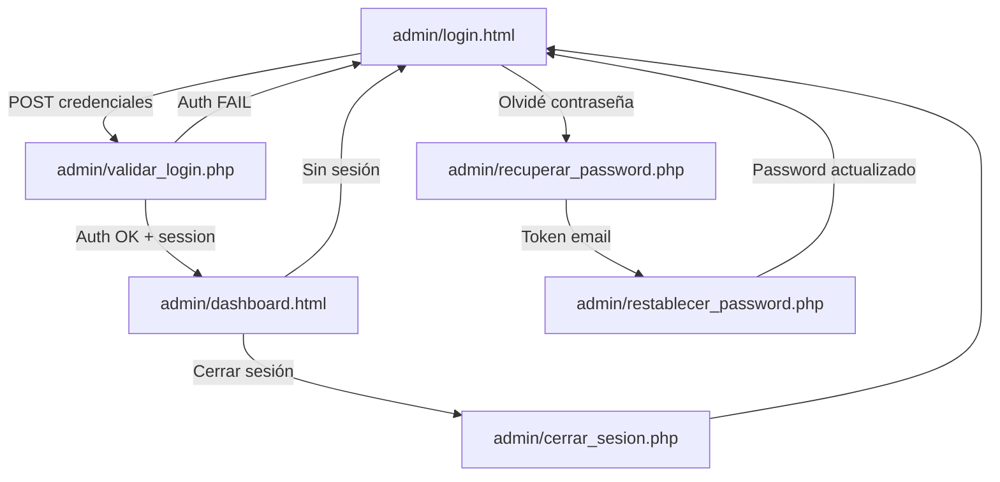

# Design Document — admin-auth-dashboard

## Overview

El módulo `admin-auth-dashboard` provee un sistema completo de autenticación y panel de control para administradores del e-commerce StepStyle. Vive bajo la carpeta `/admin` con sus propios assets (CSS, JS) completamente aislados del storefront público.

El flujo principal es:
1. El admin accede a `admin/login.html`, ingresa credenciales.
2. El formulario hace POST a `admin/validar_login.php`, que valida contra la DB y crea la sesión PHP.
3. Si la sesión es válida, el admin accede a `admin/dashboard.html` que carga métricas, gráfica y tablas.
4. El admin puede cerrar sesión via `admin/cerrar_sesion.php` o recuperar contraseña via el flujo de `admin/recuperar_password.php` → `admin/restablecer_password.php`.



---

## Architecture

El módulo sigue una arquitectura MPA (Multi-Page Application) clásica PHP + HTML estático con separación clara de responsabilidades:

```
admin/
├── login.html                  # Formulario de login (client-side validation)
├── dashboard.html              # Panel principal (requiere sesión)
├── recuperar_password.html     # Formulario solicitud de recuperación
├── restablecer_password.html   # Formulario nueva contraseña con token
├── validar_login.php           # Endpoint POST autenticación
├── cerrar_sesion.php           # Destruye sesión y redirige
├── recuperar_password.php      # Genera token y envía email
├── restablecer_password.php    # Valida token y actualiza password
├── api/
│   └── ventas_semanales.php    # Endpoint JSON para Chart.js
├── css/
│   └── admin.css               # Estilos aislados del módulo admin
└── js/
    └── admin.js                # Chart.js init, sidebar toggle, tema
```

**Capas:**
- **Presentación**: HTML5 + CSS3 (admin.css) + JS vanilla (admin.js)
- **Autenticación**: PHP sessions + password_hash/verify
- **Datos**: MySQL via PDO con prepared statements
- **Visualización**: Chart.js via CDN

**Principios de seguridad:**
- Prepared statements en todas las consultas DB
- `password_hash()` / `password_verify()` para contraseñas
- Regeneración de session ID tras login exitoso (`session_regenerate_id(true)`)
- Tokens de recuperación con expiración de 1 hora
- Mensajes de error genéricos (no revelan si email/password son incorrectos)
- Redirección inmediata si no hay sesión activa en páginas protegidas

---

## Components and Interfaces

### 1. Login Form (`admin/login.html`)

Formulario HTML puro con validación client-side en JS inline o en `admin.js`.

**Inputs:** email, password  
**Validaciones client-side:**
- Email requerido + formato válido (`type="email"` + regex)
- Password requerido

**Acción:** POST a `admin/validar_login.php`

**Muestra error** si URL contiene `?error=1` (redirigido desde validar_login.php).

---

### 2. Auth Backend (`admin/validar_login.php`)

```
POST /admin/validar_login.php
Body: email, password (form-encoded)

Flujo:
  1. Rechaza GET → redirect login
  2. Sanitiza inputs
  3. SELECT * FROM usuarios WHERE email = ? AND rol = 'admin'
  4. password_verify($password, $row['password'])
  5. OK → session_regenerate_id(true), $_SESSION[admin_*], redirect dashboard.html
  6. FAIL → redirect login.html?error=1
```

---

### 3. Session Guard (incluido en dashboard.html via PHP inline o include)

Cada página protegida inicia con:
```php
session_start();
if (!isset($_SESSION['admin_id'])) {
    header('Location: login.html');
    exit;
}
```

---

### 4. Logout (`admin/cerrar_sesion.php`)

```php
session_start();
session_destroy();
header('Location: login.html');
exit;
```

---

### 5. Password Recovery

**`admin/recuperar_password.php`** (POST handler):
1. Recibe email
2. Busca usuario con ese email y `rol = 'admin'`
3. Si existe: genera token `bin2hex(random_bytes(32))`, inserta en `password_resets`, envía email con link
4. Siempre muestra el mismo mensaje de confirmación (no revela si el email existe)

**`admin/restablecer_password.php`** (GET + POST):
- GET: muestra formulario si token válido y no expirado
- POST: valida token, actualiza `password_hash($nueva, PASSWORD_DEFAULT)`, elimina token de DB

---

### 6. Dashboard (`admin/dashboard.html`)

Estructura de la página:

```
<body>
  <aside class="sidebar">        ← Sidebar con nav + user info
  <main class="main-content">
    <header class="topbar">      ← Hamburger + theme toggle
    <section class="stats-grid"> ← 4 Stats Cards
    <section class="charts">     ← Sales Chart (canvas)
    <section class="tables">
      <div class="orders-table"> ← Últimos 10 pedidos
      <div class="critical-stock">← Stock crítico
```

---

### 7. Stats Cards (PHP inline en dashboard.html)

Cuatro consultas PHP al cargar la página:

| Card | Query |
|------|-------|
| Total productos | `SELECT COUNT(*) FROM productos` |
| Pedidos pendientes | `SELECT COUNT(*) FROM pedidos WHERE estado = 'pendiente'` |
| Ventas del día | `SELECT COALESCE(SUM(total), 0) FROM pedidos WHERE DATE(fecha_pedido) = CURDATE()` |
| Stock bajo | `SELECT COUNT(DISTINCT producto_id) FROM tallas WHERE stock <= 5` |

---

### 8. Sales Chart API (`admin/api/ventas_semanales.php`)

```
GET /admin/api/ventas_semanales.php
Response: application/json
{
  "labels": ["Lun", "Mar", "Mié", "Jue", "Vie", "Sáb", "Dom"],
  "data": [1200.00, 850.50, 0, 2100.00, 1750.00, 3200.00, 980.00]
}
```

Query:
```sql
SELECT DATE(fecha_pedido) as dia, COALESCE(SUM(total), 0) as total
FROM pedidos
WHERE fecha_pedido >= DATE_SUB(CURDATE(), INTERVAL 6 DAY)
GROUP BY DATE(fecha_pedido)
ORDER BY dia ASC
```

Los días sin ventas se rellenan con 0 en PHP antes de devolver el JSON.

---

### 9. Orders Table (PHP inline en dashboard.html)

```sql
SELECT p.id, u.nombre, p.total, p.estado, p.fecha_pedido
FROM pedidos p
JOIN usuarios u ON p.usuario_id = u.id
ORDER BY p.fecha_pedido DESC
LIMIT 10
```

Badge de estado por CSS class: `.badge-pendiente`, `.badge-procesando`, `.badge-enviado`, `.badge-entregado`, `.badge-cancelado`

---

### 10. Critical Stock List (PHP inline en dashboard.html)

```sql
SELECT pr.nombre, t.talla, t.stock
FROM tallas t
JOIN productos pr ON t.producto_id = pr.id
WHERE t.stock <= 5
ORDER BY t.stock ASC
```

---

### 11. Admin CSS (`admin/css/admin.css`)

Variables CSS (tema oscuro por defecto):
```css
:root {
  --admin-bg: #0f0f1a;
  --admin-sidebar-bg: #1a1a2e;
  --admin-card-bg: #16213e;
  --admin-text: #e0e0e0;
  --admin-accent: #e94560;
  --admin-accent-2: #f5a623;
}
body.light-theme {
  --admin-bg: #f4f6f9;
  --admin-sidebar-bg: #ffffff;
  --admin-card-bg: #ffffff;
  --admin-text: #1a1a2e;
}
```

Breakpoints: `@media (max-width: 768px)` y `@media (max-width: 1024px)`

---

### 12. Admin JS (`admin/js/admin.js`)

Responsabilidades:
- `initChart(labels, data)` — inicializa Chart.js con datos del endpoint
- `toggleSidebar()` — toggle clase `.sidebar-open` en body
- `toggleTheme()` — toggle clase `.light-theme` en body + `localStorage.setItem('admin-theme', ...)`
- `restoreTheme()` — lee `localStorage` al cargar y aplica clase si corresponde
- `handleChartError(err)` — muestra mensaje de error en el contenedor del chart sin throw

---

## Data Models

### Tabla `usuarios` (existente)

| Campo | Tipo | Notas |
|-------|------|-------|
| id | INT PK AUTO_INCREMENT | |
| nombre | VARCHAR(100) | |
| email | VARCHAR(150) UNIQUE | |
| password | VARCHAR(255) | bcrypt hash |
| rol | ENUM('cliente','admin') | Filtro de acceso |
| fecha_registro | DATETIME | |

### Tabla `productos` (existente)

| Campo | Tipo | Notas |
|-------|------|-------|
| id | INT PK | |
| nombre | VARCHAR(200) | |
| precio | DECIMAL(10,2) | |
| ... | ... | otros campos del catálogo |

### Tabla `tallas` (existente)

| Campo | Tipo | Notas |
|-------|------|-------|
| id | INT PK | |
| producto_id | INT FK → productos.id | |
| talla | VARCHAR(10) | |
| stock | INT | Stock crítico: stock ≤ 5 |

### Tabla `pedidos` (existente)

| Campo | Tipo | Notas |
|-------|------|-------|
| id | INT PK | |
| usuario_id | INT FK → usuarios.id | |
| total | DECIMAL(10,2) | |
| estado | ENUM('pendiente','procesando','enviado','entregado','cancelado') | |
| fecha_pedido | DATETIME | |

### Tabla `password_resets` (nueva)

| Campo | Tipo | Notas |
|-------|------|-------|
| id | INT PK AUTO_INCREMENT | |
| email | VARCHAR(150) | |
| token | VARCHAR(64) | `bin2hex(random_bytes(32))` |
| expires_at | DATETIME | NOW() + 1 hora |

```sql
CREATE TABLE IF NOT EXISTS password_resets (
  id INT AUTO_INCREMENT PRIMARY KEY,
  email VARCHAR(150) NOT NULL,
  token VARCHAR(64) NOT NULL UNIQUE,
  expires_at DATETIME NOT NULL,
  INDEX idx_token (token),
  INDEX idx_email (email)
);
```

---


## Correctness Properties

*A property is a characteristic or behavior that should hold true across all valid executions of a system — essentially, a formal statement about what the system should do. Properties serve as the bridge between human-readable specifications and machine-verifiable correctness guarantees.*

**Property Reflection:** Tras analizar el prework, se consolidaron las siguientes propiedades eliminando redundancias:
- 2.2, 2.3, 2.4, 2.5 se unifican en una sola property de autenticación exitosa (Property 2), ya que todas describen el mismo flujo.
- 3.1 y 3.2 se unifican en Property 4 (protección de rutas).
- 6.2, 6.3 y 11.2 se unifican en Property 7 (datos del chart).
- 7.1 y 7.3 se unifican en Property 8 (orders table).
- 8.1, 8.2 y 8.3 se unifican en Property 9 (critical stock).
- 11.3 y 11.4 se unifican en Property 11 (round-trip de tema).

---

### Property 1: Validación de formato de email

*For any* string que no tenga formato de email válido (sin `@`, sin dominio, etc.), el Login_Form debe rechazarlo con un mensaje de error de formato antes de enviar la solicitud al servidor.

**Validates: Requirements 1.7**

---

### Property 2: Autenticación exitosa crea sesión completa

*For any* usuario con `rol = 'admin'` en la DB, cuando se envía su email y contraseña correcta al endpoint POST, la sesión resultante debe contener exactamente `admin_id`, `admin_nombre` y `admin_email` con los valores correspondientes al usuario autenticado.

**Validates: Requirements 1.3, 2.2, 2.3, 2.4, 2.5**

---

### Property 3: Credenciales inválidas no revelan información

*For any* combinación de credenciales inválidas (email inexistente, password incorrecto, usuario con rol distinto de 'admin'), el sistema debe redirigir con el mismo parámetro de error genérico `?error=1`, sin distinguir cuál campo es incorrecto.

**Validates: Requirements 1.4, 2.6**

---

### Property 4: Protección de rutas sin sesión

*For any* request HTTP al dashboard (o cualquier página protegida) sin una sesión PHP activa con `admin_id`, el sistema debe redirigir inmediatamente a `login.html` sin renderizar contenido del dashboard.

**Validates: Requirements 3.1, 3.2**

---

### Property 5: Recuperación de contraseña — respuesta uniforme

*For any* email enviado al formulario de recuperación (registrado o no registrado como admin), el mensaje de respuesta mostrado al usuario debe ser idéntico, sin revelar si el email existe en el sistema.

**Validates: Requirements 4.3**

---

### Property 6: Token de recuperación — formato y expiración

*For any* solicitud de recuperación con email de admin válido, el token generado debe tener exactamente 64 caracteres hexadecimales y el campo `expires_at` en DB debe ser aproximadamente 1 hora en el futuro (NOW() + 3600 segundos, con tolerancia de ±5 segundos).

**Validates: Requirements 4.4**

---

### Property 7: Round-trip de contraseña

*For any* nueva contraseña establecida mediante el flujo de restablecimiento, el hash almacenado en DB debe ser verificable con `password_verify($nueva_password, $hash)` retornando `true`.

**Validates: Requirements 4.6**

---

### Property 8: Stats Cards reflejan estado real de la DB

*For any* estado de la DB (cualquier cantidad de productos, pedidos y tallas), los valores mostrados en las 4 Stats Cards deben coincidir exactamente con los resultados de las consultas SQL correspondientes ejecutadas en el mismo instante.

**Validates: Requirements 5.2**

---

### Property 9: Endpoint de ventas semanales — completitud de 7 días

*For any* conjunto de pedidos en la DB, el endpoint `ventas_semanales.php` debe retornar exactamente 7 entradas (una por cada día de los últimos 7 días), con valor `0` para los días sin ventas y el total correcto para los días con ventas.

**Validates: Requirements 6.2, 6.5**

---

### Property 10: Orders Table — últimos 10 pedidos ordenados

*For any* estado de la DB con N pedidos (N ≥ 0), la Orders Table debe mostrar `min(N, 10)` pedidos ordenados por `fecha_pedido DESC`, con las columnas ID, nombre de cliente, total, estado y fecha correctamente pobladas mediante el JOIN con `usuarios`.

**Validates: Requirements 7.1, 7.3**

---

### Property 11: Badge de estado correcto

*For any* pedido con cualquier estado válido (`pendiente`, `procesando`, `enviado`, `entregado`, `cancelado`), el elemento de badge en la tabla debe tener exactamente la clase CSS correspondiente a ese estado.

**Validates: Requirements 7.2**

---

### Property 12: Critical Stock List — filtro, datos y orden

*For any* estado de la DB, la Critical Stock List debe contener exactamente los registros de `tallas` con `stock <= 5`, mostrando nombre del producto, talla y stock, ordenados de menor a mayor stock.

**Validates: Requirements 8.1, 8.2, 8.3**

---

### Property 13: Sidebar muestra datos del admin autenticado

*For any* admin autenticado con sesión activa, el Sidebar debe mostrar exactamente el `nombre` y `email` almacenados en `$_SESSION['admin_nombre']` y `$_SESSION['admin_email']`.

**Validates: Requirements 9.1**

---

### Property 14: Round-trip de tema claro/oscuro

*For any* preferencia de tema guardada en `localStorage` (valor `'light'` o `'dark'`), al recargar el Dashboard el Admin_JS debe restaurar exactamente esa preferencia aplicando o removiendo la clase `light-theme` del `<body>`.

**Validates: Requirements 11.3, 11.4**

---

### Property 15: Manejo de errores sin excepciones no capturadas

*For any* error en la carga de datos del chart (fallo de red, respuesta inválida, JSON malformado), el Admin_JS debe mostrar un mensaje de error en el contenedor del chart y no lanzar excepciones no capturadas al `window.onerror`.

**Validates: Requirements 11.5**

---

## Error Handling

### Errores de autenticación
- Credenciales inválidas → redirect `login.html?error=1` (mensaje genérico en frontend)
- GET a `validar_login.php` → redirect `login.html`
- Sesión expirada o ausente → redirect `login.html`

### Errores de recuperación de contraseña
- Token expirado → mensaje de error + enlace para solicitar nuevo token
- Token inválido (no existe en DB) → mismo mensaje que token expirado
- Email no registrado → mismo mensaje de confirmación que email válido

### Errores de DB
- Conexión fallida → página de error genérica (no exponer detalles de conexión)
- Query fallida → log interno + mensaje genérico al usuario

### Errores de carga de datos en dashboard
- Fallo del endpoint `ventas_semanales.php` → mensaje "No se pudieron cargar los datos de ventas" en el contenedor del chart
- Respuesta JSON inválida → mismo mensaje de error, sin throw
- Stats Cards con error de DB → mostrar "—" en lugar del valor numérico

### Errores de validación client-side
- Email vacío → "El email es requerido"
- Password vacío → "La contraseña es requerida"
- Formato de email inválido → "Ingresa un email válido"

---

## Testing Strategy

### Enfoque dual: Unit Tests + Property-Based Tests

Ambos tipos son complementarios y necesarios para cobertura completa.

**Unit Tests** — casos específicos, edge cases, integración:
- Login con credenciales correctas → sesión creada con datos correctos
- Login con email inexistente → redirect con `?error=1`
- Login con password incorrecto → redirect con `?error=1`
- Login con usuario de rol `cliente` → redirect con `?error=1`
- GET a `validar_login.php` → redirect a login
- `cerrar_sesion.php` → sesión destruida + redirect
- Token de recuperación expirado → mensaje de error
- Token de recuperación inválido → mensaje de error
- Dashboard sin sesión → redirect a login
- Critical stock vacío → mensaje "todos los productos tienen stock suficiente"
- Ventas semanales con 0 días con ventas → array de 7 ceros

**Property-Based Tests** — propiedades universales con mínimo 100 iteraciones cada una:

Librería recomendada: **PHPUnit** con **eris** (PHP property-based testing) o implementación manual de generadores con PHPUnit DataProviders para el backend PHP. Para el frontend JS: **fast-check**.

Cada test debe incluir un comentario de trazabilidad:
```
// Feature: admin-auth-dashboard, Property N: <texto de la property>
```

| Property | Test | Iteraciones |
|----------|------|-------------|
| P1: Validación formato email | Generar strings sin formato email, verificar rechazo | 100 |
| P2: Autenticación exitosa crea sesión | Generar admins aleatorios, verificar sesión completa | 100 |
| P3: Credenciales inválidas → error genérico | Generar credenciales inválidas variadas, verificar mismo error | 100 |
| P4: Protección de rutas | Generar requests sin sesión, verificar redirect | 100 |
| P5: Respuesta uniforme recuperación | Generar emails registrados y no registrados, verificar mismo mensaje | 100 |
| P6: Token formato y expiración | Generar solicitudes de recuperación, verificar token 64 hex + expires | 100 |
| P7: Round-trip contraseña | Generar passwords aleatorias, hash + verify | 100 |
| P8: Stats Cards reflejan DB | Generar estados de DB aleatorios, verificar coincidencia | 100 |
| P9: Ventas semanales 7 días completos | Generar pedidos aleatorios, verificar 7 entradas con 0s | 100 |
| P10: Orders Table 10 pedidos ordenados | Generar N pedidos, verificar min(N,10) ordenados DESC | 100 |
| P11: Badge estado correcto | Generar pedidos con estados aleatorios, verificar clase CSS | 100 |
| P12: Critical Stock filtro y orden | Generar stocks aleatorios, verificar filtro ≤5 y orden ASC | 100 |
| P13: Sidebar datos del admin | Generar admins con datos aleatorios, verificar sidebar | 100 |
| P14: Round-trip tema | Generar preferencias de tema, toggle + reload, verificar restauración | 100 |
| P15: Errores sin excepciones | Generar respuestas inválidas del endpoint, verificar no throw | 100 |

**Configuración de tests:**
- Backend PHP: PHPUnit con base de datos de test (SQLite in-memory o MySQL test DB)
- Frontend JS: Jest + fast-check para propiedades de admin.js
- Cada property test referencia su property del design con el tag de trazabilidad
