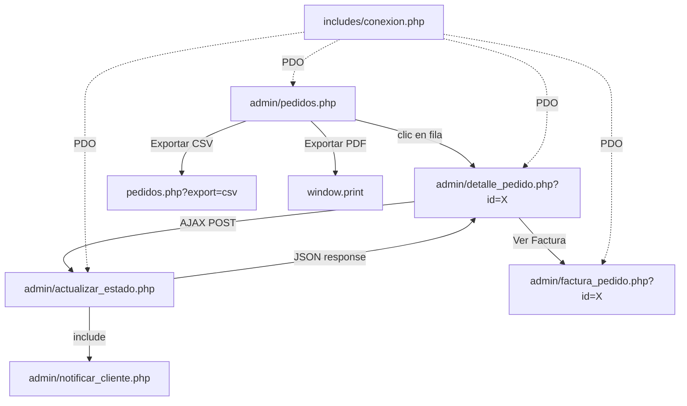

# Design Document — admin-order-management

## Overview

El módulo `admin-order-management` provee la gestión completa de pedidos para el panel de administración de StepStyle. Vive bajo `/admin` y reutiliza los assets existentes (`admin/css/admin.css`, `admin/js/admin.js`).

Flujo principal:
1. El admin accede a `admin/pedidos.php` (requiere sesión activa).
2. Puede filtrar por estado, buscar por ID/cliente y exportar a CSV o PDF.
3. Al hacer clic en un pedido navega a `admin/detalle_pedido.php?id=X`.
4. Desde el detalle puede cambiar el estado vía AJAX (→ `admin/actualizar_estado.php`), lo que dispara automáticamente el envío de email al cliente (→ `admin/notificar_cliente.php`).
5. Puede abrir la factura imprimible en `admin/factura_pedido.php?id=X`.



---

## Architecture

Arquitectura MPA (Multi-Page Application) PHP clásica, consistente con el módulo `admin-auth-dashboard` existente.

```
admin/
├── pedidos.php                 # Listado paginado con filtros y exportación CSV
├── detalle_pedido.php          # Detalle completo + cambio de estado AJAX
├── actualizar_estado.php       # Endpoint AJAX POST (JSON in/out)
├── notificar_cliente.php       # Envío de email al cliente (incluido por actualizar_estado)
├── factura_pedido.php          # Factura/boleta imprimible
├── logs/
│   └── email_errors.log        # Log de errores de envío de email
├── css/
│   └── admin.css               # Reutilizado (existente)
└── js/
    └── admin.js                # Reutilizado + showToast() + lógica AJAX pedidos
```

**Capas:**
- **Presentación**: HTML5 + CSS3 (admin.css) + JS vanilla (admin.js)
- **Lógica de negocio**: PHP puro, sin frameworks
- **Datos**: MySQL via PDO con prepared statements (`includes/conexion.php`)
- **Email**: PHP `mail()` o PHPMailer con contenido HTML
- **Exportación**: CSV server-side (headers PHP), PDF via `window.print()` + `@media print`

**Principios de seguridad:**
- Verificación de sesión al inicio de cada script PHP
- Prepared statements en todas las consultas con datos externos
- `htmlspecialchars()` en todos los outputs HTML
- Validación de `pedido_id` como entero positivo
- Validación de `estado` contra whitelist de valores permitidos

---

## Components and Interfaces

### 1. Orders List (`admin/pedidos.php`)

Página PHP que renderiza la tabla de pedidos con filtros, paginación y botones de exportación.

**Parámetros GET aceptados:**
- `estado` — filtro por estado (string, validado contra whitelist)
- `busqueda` — texto libre para búsqueda (string, sanitizado)
- `pagina` — número de página actual (int, default 1)
- `export` — valor `csv` para disparar exportación

**Query principal:**
```sql
SELECT p.id, p.fecha_pedido, u.nombre, u.email, p.total, p.estado
FROM pedidos p
JOIN usuarios u ON p.usuario_id = u.id
WHERE (:estado = '' OR p.estado = :estado)
  AND (:busqueda = '' OR p.id = :busqueda_id
       OR u.nombre LIKE :busqueda_like
       OR u.email LIKE :busqueda_like)
ORDER BY p.fecha_pedido DESC
LIMIT 20 OFFSET :offset
```

**Exportación CSV:** cuando `export=csv`, se omite la paginación, se envían headers `Content-Type: text/csv` y `Content-Disposition: attachment; filename="pedidos_YYYY-MM-DD.csv"` y se hace `echo` del contenido CSV directamente.

---

### 2. Order Detail (`admin/detalle_pedido.php`)

Página PHP que muestra toda la información de un pedido individual.

**Parámetro GET:** `id` (int, validado como entero positivo)

**Queries:**
```sql
-- Datos del pedido + cliente
SELECT p.*, u.nombre, u.email, u.telefono, u.direccion
FROM pedidos p JOIN usuarios u ON p.usuario_id = u.id
WHERE p.id = :id

-- Líneas de detalle
SELECT dp.*, pr.nombre AS producto_nombre, pr.imagen
FROM detalle_pedido dp
JOIN productos pr ON dp.producto_id = pr.id
WHERE dp.pedido_id = :id

-- Historial de estados
SELECT h.*, u.nombre AS admin_nombre
FROM historial_estados h
JOIN usuarios u ON h.admin_id = u.id
WHERE h.pedido_id = :id
ORDER BY h.fecha_cambio DESC
```

---

### 3. Status Updater (`admin/actualizar_estado.php`)

Endpoint AJAX exclusivo para POST con `Content-Type: application/json`.

**Request:**
```json
{ "pedido_id": 42, "estado": "procesando" }
```

**Flujo:**
1. Verificar sesión activa → 401 si no hay sesión
2. Rechazar métodos distintos de POST → 405
3. Leer y decodificar JSON body
4. Validar `pedido_id` (entero positivo) → 400 si inválido
5. Validar `estado` contra whitelist → 422 si inválido
6. Obtener `estado_anterior` del pedido
7. UPDATE `pedidos` SET `estado` = :nuevo WHERE `id` = :id
8. INSERT en `historial_estados`
9. Incluir `notificar_cliente.php` para envío de email
10. Retornar `{"success": true, "nuevo_estado": "procesando"}`

**Respuestas de error:**
```json
{"success": false, "error": "Datos inválidos"}        // HTTP 400
{"success": false, "error": "Estado no válido"}       // HTTP 422
{"success": false, "error": "Error al actualizar"}    // HTTP 500
```

---

### 4. Email Notifier (`admin/notificar_cliente.php`)

Script incluido por `actualizar_estado.php`. Recibe variables `$pedido_id`, `$nuevo_estado`, `$cliente_email`, `$cliente_nombre` del scope del inclusor.

**Mensajes por estado:**
| Estado | Mensaje |
|--------|---------|
| pagado | "Hemos confirmado el pago de tu pedido." |
| procesando | "Tu pedido está siendo preparado." |
| enviado | "Tu pedido ha sido enviado y está en camino." |
| entregado | "Tu pedido ha sido entregado. ¡Gracias por tu compra!" |
| cancelado | "Tu pedido ha sido cancelado. Contáctanos si tienes dudas." |

**Email HTML template:**
```
Asunto: StepStyle - Actualización de tu pedido #[id]
De: noreply@stepstyle.com
```

Si el envío falla, registra en `admin/logs/email_errors.log` sin interrumpir el flujo.

---

### 5. Invoice (`admin/factura_pedido.php`)

Página PHP standalone con estilos inline + `@media print`. Abre en nueva pestaña.

**Parámetro GET:** `id` (int, validado)

Incluye: logo/nombre StepStyle, número de pedido, fecha, datos del cliente, tabla de productos, total, estado actual. El botón "Imprimir" llama a `window.print()`.

---

### 6. Estado Flow Logic

```
ESTADOS_VALIDOS = ['pendiente', 'pagado', 'procesando', 'enviado', 'entregado', 'cancelado']

TRANSICIONES_PERMITIDAS = {
  'pendiente':   ['pagado', 'cancelado'],
  'pagado':      ['procesando', 'cancelado'],
  'procesando':  ['enviado', 'cancelado'],
  'enviado':     ['entregado', 'cancelado'],
  'entregado':   [],          // estado final, sin transiciones
  'cancelado':   []           // estado final, sin transiciones
}
```

`actualizar_estado.php` valida que la transición sea permitida antes de ejecutar el UPDATE.

---

### 7. Toast Notifications (`admin/js/admin.js`)

```javascript
// Función showToast ya definida en admin.js existente
showToast(message, type)  // type: 'success' | 'error' | 'info'
```

- Posición: esquina inferior derecha
- Auto-dismiss: 4 segundos
- Click para descartar inmediatamente
- Múltiples toasts apilados sin superposición
- Colores: verde (success), rojo (error), azul (info) via variables CSS de admin.css

---

### 8. AJAX Flow en Order Detail

```javascript
async function cambiarEstado(pedidoId, nuevoEstado) {
  try {
    const res = await fetch('actualizar_estado.php', {
      method: 'POST',
      headers: { 'Content-Type': 'application/json' },
      body: JSON.stringify({ pedido_id: pedidoId, estado: nuevoEstado })
    });
    const data = await res.json();
    if (data.success) {
      actualizarBadgeEstado(data.nuevo_estado);
      showToast('Estado actualizado correctamente', 'success');
    } else {
      showToast(data.error || 'Error al actualizar', 'error');
    }
  } catch (e) {
    showToast('Error de conexión', 'error');
  }
}
```

---

## Data Models

### Tabla `pedidos` (existente — modificación de ENUM)

| Campo | Tipo | Notas |
|-------|------|-------|
| id | INT PK AUTO_INCREMENT | |
| usuario_id | INT FK → usuarios.id | |
| total | DECIMAL(10,2) | |
| estado | ENUM('pendiente','pagado','procesando','enviado','entregado','cancelado') | Añadir 'pagado' al ENUM existente |
| fecha_pedido | DATETIME | |

```sql
ALTER TABLE pedidos
  MODIFY COLUMN estado ENUM('pendiente','pagado','procesando','enviado','entregado','cancelado')
  NOT NULL DEFAULT 'pendiente';
```

---

### Tabla `historial_estados` (nueva)

| Campo | Tipo | Notas |
|-------|------|-------|
| id | INT PK AUTO_INCREMENT | |
| pedido_id | INT FK → pedidos.id ON DELETE CASCADE | |
| estado_anterior | ENUM('pendiente','pagado','procesando','enviado','entregado','cancelado') | |
| estado_nuevo | ENUM('pendiente','pagado','procesando','enviado','entregado','cancelado') | |
| admin_id | INT FK → usuarios.id | |
| fecha_cambio | TIMESTAMP DEFAULT CURRENT_TIMESTAMP | |

```sql
CREATE TABLE IF NOT EXISTS historial_estados (
  id INT AUTO_INCREMENT PRIMARY KEY,
  pedido_id INT NOT NULL,
  estado_anterior ENUM('pendiente','pagado','procesando','enviado','entregado','cancelado') NOT NULL,
  estado_nuevo ENUM('pendiente','pagado','procesando','enviado','entregado','cancelado') NOT NULL,
  admin_id INT NOT NULL,
  fecha_cambio TIMESTAMP DEFAULT CURRENT_TIMESTAMP,
  FOREIGN KEY (pedido_id) REFERENCES pedidos(id) ON DELETE CASCADE,
  FOREIGN KEY (admin_id) REFERENCES usuarios(id),
  INDEX idx_pedido_id (pedido_id),
  INDEX idx_fecha_cambio (fecha_cambio)
);
```

---

### Tabla `detalle_pedido` (existente — referencia)

| Campo | Tipo | Notas |
|-------|------|-------|
| id | INT PK AUTO_INCREMENT | |
| pedido_id | INT FK → pedidos.id | |
| producto_id | INT FK → productos.id | |
| talla | VARCHAR(10) | |
| cantidad | INT | |
| precio_unitario | DECIMAL(10,2) | |

---

### Tabla `usuarios` (existente — referencia)

| Campo | Tipo | Notas |
|-------|------|-------|
| id | INT PK | |
| nombre | VARCHAR(100) | |
| email | VARCHAR(150) UNIQUE | |
| telefono | VARCHAR(20) | Opcional |
| direccion | TEXT | Opcional |
| rol | ENUM('cliente','admin') | |


---

## Correctness Properties

*A property is a characteristic or behavior that should hold true across all valid executions of a system — essentially, a formal statement about what the system should do. Properties serve as the bridge between human-readable specifications and machine-verifiable correctness guarantees.*

**Property Reflection:** Tras el análisis del prework se consolidaron las propiedades eliminando redundancias:
- 1.1, 1.2, 4.1, 4.2, 8.2, 10.1 → Property 1 (session guard unificada)
- 1.3 + 4.3 → Property 2 (datos completos del pedido en listado y detalle)
- 1.4 + badge de 5.9 → Property 3 (badge de estado correcto)
- 3.2 + 3.3 + 3.4 → Property 6 (CSV export completeness)
- 3.5 + 3.6 → Property 7 (PDF/print view completeness)
- 5.7 + 5.8 + 10.4 + 10.5 → Property 10 (validación de inputs en Status_Updater)
- 6.1 + 6.2 → Property 12 (invocación del Email_Notifier)
- 6.4 + 6.5 + 6.7 → Property 13 (contenido del email)

---

### Property 1: Session guard en todos los scripts protegidos

*For any* request HTTP a cualquiera de los scripts protegidos (`pedidos.php`, `detalle_pedido.php`, `actualizar_estado.php`, `factura_pedido.php`) sin una sesión PHP activa con `admin_id`, el sistema debe redirigir inmediatamente a `admin/login.html` sin renderizar contenido ni ejecutar lógica de negocio.

**Validates: Requirements 1.1, 1.2, 4.1, 4.2, 8.2, 10.1**

---

### Property 2: Listado muestra todas las columnas requeridas

*For any* conjunto de pedidos en la DB, la tabla renderizada por `pedidos.php` debe contener exactamente las columnas ID, fecha, nombre del cliente, email del cliente, total y estado, con los valores correctos obtenidos mediante el JOIN con `usuarios`.

**Validates: Requirements 1.3**

---

### Property 3: Badge de estado correcto en listado y detalle

*For any* pedido con cualquier estado válido (`pendiente`, `pagado`, `procesando`, `enviado`, `entregado`, `cancelado`), el elemento badge en la tabla y en el detalle debe tener exactamente la clase CSS correspondiente a ese estado.

**Validates: Requirements 1.4**

---

### Property 4: Paginación — tamaño de página invariante

*For any* número N de pedidos en la DB (con o sin filtros activos), la página renderizada debe mostrar `min(N, 20)` pedidos, y los controles de paginación deben reflejar correctamente el número total de páginas `ceil(N / 20)`.

**Validates: Requirements 1.5, 1.6**

---

### Property 5: Enlace de fila apunta al pedido correcto

*For any* pedido en el listado, el enlace o atributo `href` de la fila debe contener el `id` exacto de ese pedido como parámetro GET (`?id=X`).

**Validates: Requirements 1.7**

---

### Property 6: CSV export — completitud y estructura

*For any* conjunto de pedidos filtrados (sin paginación), el CSV generado debe contener exactamente esos pedidos (ni más ni menos), con una fila de encabezado con los nombres `ID,Fecha,Cliente,Email,Total,Estado` y una fila de datos por cada pedido con los valores correctos.

**Validates: Requirements 3.2, 3.3, 3.4**

---

### Property 7: PDF/print view — contenido completo

*For any* conjunto de pedidos filtrados, la vista de impresión debe contener el nombre/logo de StepStyle, la fecha de generación y una tabla con las columnas ID, Fecha, Cliente, Total, Estado con los datos correctos de cada pedido.

**Validates: Requirements 3.5, 3.6**

---

### Property 8: Filtro por estado — exclusividad

*For any* valor de estado seleccionado en Order_Filter y cualquier conjunto de pedidos en la DB, todos los pedidos retornados deben tener exactamente ese estado, y ningún pedido con estado diferente debe aparecer en los resultados.

**Validates: Requirements 2.2**

---

### Property 9: Búsqueda de texto — cobertura y case-insensitivity

*For any* cadena de búsqueda y cualquier conjunto de pedidos, todos los pedidos retornados deben satisfacer al menos una de las condiciones: `id` coincide exactamente, `nombre` contiene la cadena (case-insensitive), o `email` contiene la cadena (case-insensitive). Ningún pedido que no satisfaga ninguna condición debe aparecer.

**Validates: Requirements 2.4, 2.5**

---

### Property 10: Validación de inputs en Status_Updater

*For any* request a `actualizar_estado.php` que sea no-POST, o que tenga `pedido_id` no entero/no positivo, o que tenga `estado` fuera del conjunto permitido, el endpoint debe retornar un código HTTP de error (400 o 422) con `{"success": false}` y no modificar la DB.

**Validates: Requirements 5.3, 5.7, 5.8, 10.4, 10.5**

---

### Property 11: Round-trip de cambio de estado

*For any* pedido con estado S1 y una transición válida a estado S2, después de una llamada exitosa a `actualizar_estado.php`: (a) el campo `estado` en la tabla `pedidos` debe ser S2, (b) la respuesta JSON debe contener `{"success": true, "nuevo_estado": "S2"}`, y (c) debe existir un registro en `historial_estados` con `estado_anterior=S1`, `estado_nuevo=S2`, `pedido_id` correcto y `admin_id` correcto.

**Validates: Requirements 5.4, 5.5, 5.6**

---

### Property 12: Email_Notifier invocado en cada cambio exitoso

*For any* cambio de estado exitoso procesado por `actualizar_estado.php`, el Email_Notifier debe ser invocado exactamente una vez con el email del cliente, el número de pedido y el nuevo estado correctos.

**Validates: Requirements 6.1, 6.2**

---

### Property 13: Contenido del email es completo y correcto

*For any* cambio de estado, el email enviado debe contener: el número de pedido, el nuevo estado, la fecha del cambio, el mensaje personalizado correspondiente al nuevo estado, el nombre del cliente en el saludo, el remitente `noreply@stepstyle.com` y el asunto `"StepStyle - Actualización de tu pedido #[id]"`.

**Validates: Requirements 6.4, 6.5, 6.7**

---

### Property 14: Fallo de email no interrumpe respuesta AJAX

*For any* fallo en el envío del email (excepción, mail() retorna false, etc.), `actualizar_estado.php` debe igualmente retornar `{"success": true, "nuevo_estado": "..."}` al cliente, y el error debe quedar registrado en `admin/logs/email_errors.log`.

**Validates: Requirements 6.6**

---

### Property 15: Cascade delete en historial_estados

*For any* pedido con N registros en `historial_estados`, al eliminar ese pedido de la tabla `pedidos`, todos sus N registros en `historial_estados` deben ser eliminados automáticamente.

**Validates: Requirements 7.2**

---

### Property 16: Factura contiene todos los elementos requeridos

*For any* pedido válido, la página `factura_pedido.php?id=X` debe renderizar: nombre/logo de StepStyle, número de pedido, fecha, nombre y email del cliente, tabla de productos con nombre/talla/cantidad/precio unitario/subtotal, total del pedido y estado actual.

**Validates: Requirements 8.3**

---

### Property 17: Botones de transición corresponden al estado actual

*For any* pedido con estado S, los botones de cambio de estado mostrados en `detalle_pedido.php` deben corresponder exactamente al conjunto `TRANSICIONES_PERMITIDAS[S]` y no mostrar ningún estado fuera de ese conjunto.

**Validates: Requirements 5.1**

---

### Property 18: Toast auto-dismiss y click-dismiss

*For any* toast mostrado por `showToast()`: (a) debe desaparecer del DOM automáticamente después de 4 segundos, y (b) al hacer clic sobre él debe desaparecer inmediatamente.

**Validates: Requirements 9.3, 9.4**

---

### Property 19: Toast type determina clase CSS

*For any* llamada a `showToast(message, type)` con `type` en `['success', 'error', 'info']`, el elemento toast creado debe tener exactamente la clase CSS correspondiente a ese tipo.

**Validates: Requirements 9.6**

---

### Property 20: XSS prevention en outputs HTML

*For any* dato de usuario (nombre, email, descripción de producto, etc.) que contenga caracteres especiales HTML (`<`, `>`, `"`, `&`), el HTML renderizado debe contener la versión escapada con `htmlspecialchars()` y no el carácter literal.

**Validates: Requirements 10.3**

---

## Error Handling

### Errores de autenticación / sesión
- Sin sesión activa → redirect inmediato a `admin/login.html` (todos los scripts)
- `pedido_id` inválido o inexistente → mensaje de error + enlace a `pedidos.php`

### Errores en Status_Updater
- Método no POST → HTTP 405
- JSON body inválido / campos faltantes → `{"success": false, "error": "Datos inválidos"}` HTTP 400
- Estado fuera del Enum → `{"success": false, "error": "Estado no válido"}` HTTP 422
- Transición de estado no permitida → `{"success": false, "error": "Transición no permitida"}` HTTP 422
- Error de DB → `{"success": false, "error": "Error al actualizar"}` HTTP 500

### Errores de email
- Fallo de `mail()` / PHPMailer → log en `admin/logs/email_errors.log` con timestamp, pedido_id y mensaje de error
- El fallo de email NO interrumpe la respuesta JSON de `actualizar_estado.php`

### Errores de exportación CSV
- Sin pedidos en el filtro → CSV con solo la fila de encabezado
- Error de DB → mensaje de error HTTP 500

### Errores de factura
- `id` inexistente → mensaje "Pedido no encontrado" + enlace a `pedidos.php`
- Sin sesión → redirect a `login.html`

### Errores de DB (general)
- Conexión fallida → página de error genérica sin exponer detalles de conexión
- Query fallida → log interno + mensaje genérico al usuario

---

## Testing Strategy

### Enfoque dual: Unit Tests + Property-Based Tests

Ambos tipos son complementarios y necesarios para cobertura completa.

**Unit Tests** — casos específicos, edge cases, integración:
- `pedidos.php` sin sesión → redirect a login
- `pedidos.php` con sesión → tabla con columnas correctas
- Filtro por estado `enviado` → solo pedidos con ese estado
- Búsqueda por ID exacto → retorna el pedido correcto
- Búsqueda por nombre parcial case-insensitive → retorna pedidos correctos
- Filtro + búsqueda combinados → AND lógico correcto
- Paginación con 45 pedidos → página 1 muestra 20, página 3 muestra 5
- Exportación CSV con filtro activo → CSV sin paginación con encabezado
- `detalle_pedido.php` con id válido → todos los datos del pedido
- `detalle_pedido.php` con id inexistente → mensaje de error
- `actualizar_estado.php` GET → HTTP 405
- `actualizar_estado.php` POST sin pedido_id → HTTP 400
- `actualizar_estado.php` POST con estado inválido → HTTP 422
- `actualizar_estado.php` POST válido → DB actualizada + historial insertado + JSON success
- Transición no permitida (ej. entregado → procesando) → HTTP 422
- Email falla → log registrado + respuesta AJAX sigue siendo success
- `factura_pedido.php` con id válido → todos los elementos requeridos
- `factura_pedido.php` con id inexistente → mensaje de error
- `showToast('msg', 'success')` → elemento con clase success creado
- Toast click → elemento removido del DOM inmediatamente
- Cascade delete: eliminar pedido → historial_estados eliminado

**Property-Based Tests** — propiedades universales con mínimo 100 iteraciones cada una:

Librería recomendada: **PHPUnit** con generadores manuales (DataProviders) para el backend PHP. Para el frontend JS: **fast-check**.

Cada test debe incluir un comentario de trazabilidad:
```
// Feature: admin-order-management, Property N: <texto de la property>
```

| Property | Test | Iteraciones |
|----------|------|-------------|
| P1: Session guard | Generar requests sin sesión a cada script protegido, verificar redirect | 100 |
| P2: Columnas del listado | Generar N pedidos aleatorios, verificar todas las columnas presentes | 100 |
| P3: Badge de estado | Generar pedidos con estados aleatorios, verificar clase CSS del badge | 100 |
| P4: Paginación invariante | Generar N pedidos aleatorios, verificar min(N,20) en página y ceil(N/20) total | 100 |
| P5: Enlace de fila | Generar pedidos aleatorios, verificar href contiene id correcto | 100 |
| P6: CSV completitud | Generar pedidos filtrados aleatorios, verificar CSV contiene exactamente esos pedidos | 100 |
| P7: PDF/print view | Generar pedidos aleatorios, verificar elementos requeridos en vista de impresión | 100 |
| P8: Filtro por estado | Generar pedidos con estados mixtos, aplicar filtro, verificar exclusividad | 100 |
| P9: Búsqueda case-insensitive | Generar strings de búsqueda y pedidos, verificar cobertura y no falsos positivos | 100 |
| P10: Validación inputs | Generar inputs inválidos variados, verificar rechazo sin modificar DB | 100 |
| P11: Round-trip estado | Generar transiciones válidas, verificar DB + respuesta JSON + historial | 100 |
| P12: Email invocado | Generar cambios de estado exitosos, verificar invocación del notifier | 100 |
| P13: Contenido email | Generar cambios de estado, verificar todos los campos del email | 100 |
| P14: Fallo email no interrumpe | Simular fallo de mail(), verificar respuesta AJAX success + log | 100 |
| P15: Cascade delete | Generar pedidos con historial, eliminar pedido, verificar cascade | 100 |
| P16: Factura completa | Generar pedidos aleatorios, verificar todos los elementos en factura | 100 |
| P17: Botones de transición | Generar pedidos con estados aleatorios, verificar botones = TRANSICIONES_PERMITIDAS[estado] | 100 |
| P18: Toast dismiss | Generar toasts, verificar auto-dismiss a 4s y click-dismiss inmediato | 100 |
| P19: Toast CSS class | Generar llamadas showToast con tipos aleatorios, verificar clase CSS | 100 |
| P20: XSS prevention | Generar strings con caracteres HTML especiales, verificar htmlspecialchars en output | 100 |

**Configuración de tests:**
- Backend PHP: PHPUnit con base de datos de test (MySQL test DB o SQLite in-memory)
- Frontend JS: Jest + fast-check para propiedades de `admin.js`
- Cada property test referencia su property del design con el tag de trazabilidad
- Mínimo 100 iteraciones por property test
