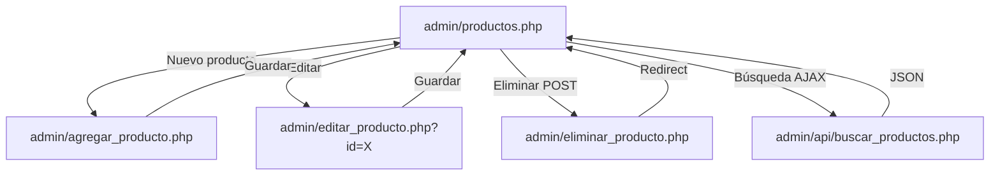

# Design Document — admin-product-crud

## Overview

El módulo `admin-product-crud` provee la gestión completa de productos para el panel de administración del e-commerce StepStyle. Permite a los administradores crear, listar, editar y eliminar productos con sus variantes de tallas, colores e imágenes.

El flujo principal es:
1. El admin accede a `admin/productos.php` — listado paginado con búsqueda AJAX y filtros.
2. Desde el listado puede navegar a `admin/agregar_producto.php` para crear un nuevo producto.
3. Desde el listado puede navegar a `admin/editar_producto.php?id=X` para editar un producto existente.
4. La eliminación se procesa via POST a `admin/eliminar_producto.php` con confirmación previa.
5. La búsqueda en tiempo real consume `admin/api/buscar_productos.php` (endpoint JSON).



---

## Architecture

El módulo sigue la arquitectura MPA (Multi-Page Application) PHP + HTML con JS vanilla, consistente con el resto del panel admin de StepStyle.

```
admin/
├── productos.php               # Listado paginado con búsqueda AJAX y filtros
├── agregar_producto.php        # Formulario de creación de producto
├── editar_producto.php         # Formulario de edición con datos precargados
├── eliminar_producto.php       # Endpoint POST de eliminación
├── api/
│   └── buscar_productos.php    # Endpoint JSON para búsqueda en tiempo real
├── css/
│   └── admin.css               # Reutilizado del módulo existente
└── js/
    └── admin.js                # Reutilizado + extensiones para este módulo

uploads/
└── productos/                  # Imágenes subidas con nombres únicos (uniqid())

includes/
└── conexion.php                # Conexión PDO existente (reutilizada)
```

**Capas:**
- **Presentación**: HTML5 + CSS3 (admin.css) + JS vanilla (admin.js)
- **Editor de texto**: Quill.js via CDN (descripción del producto)
- **Imágenes**: HTML5 File API con drag-and-drop (sin librerías externas)
- **Variantes**: Stock_Table con filas dinámicas JS vanilla; Color_Picker con `input[type=color]` + `input[text]`
- **Datos**: MySQL via PDO con prepared statements (`includes/conexion.php`)

**Principios de seguridad:**
- Prepared statements en todas las consultas DB
- Validación server-side de todos los inputs
- `htmlspecialchars()` en toda salida HTML
- Verificación de sesión admin al inicio de cada script
- Validación de tipo MIME y extensión en uploads de imágenes
- Nombres de archivo únicos con `uniqid()` para evitar colisiones y path traversal

---

## Components and Interfaces

### 1. Products List (`admin/productos.php`)

Página principal del módulo. Requiere sesión activa de admin.

**Funcionalidades:**
- Tabla paginada (20 productos por página) con columnas: imagen, nombre, categoría, precio, stock total, acciones
- Filtro por categoría (`deportivo`, `casual`, `formal`) via GET
- Búsqueda en tiempo real via AJAX al endpoint `api/buscar_productos.php`
- Botones de acción por fila: Editar (link GET) y Eliminar (form POST con confirmación JS)
- Botón "Agregar Producto" en la cabecera

**Paginación:** parámetros GET `?pagina=N&categoria=X&q=texto`

---

### 2. Search API (`admin/api/buscar_productos.php`)

Endpoint JSON para búsqueda en tiempo real desde el listado.

```
GET /admin/api/buscar_productos.php?q=texto&categoria=X&pagina=N
Response: application/json
{
  "productos": [
    {
      "id": 1,
      "nombre": "...",
      "categoria": "deportivo",
      "precio": 89.99,
      "imagen_principal": "uploads/productos/abc123.jpg",
      "stock_total": 45
    }
  ],
  "total": 12,
  "paginas": 1
}
```

Query base:
```sql
SELECT p.id, p.nombre, p.categoria, p.precio, p.imagen_principal,
       COALESCE(SUM(t.stock), 0) as stock_total
FROM productos p
LEFT JOIN tallas t ON t.producto_id = p.id
WHERE p.nombre LIKE ? AND (? = '' OR p.categoria = ?)
GROUP BY p.id
ORDER BY p.fecha_creacion DESC
LIMIT ? OFFSET ?
```

---

### 3. Add Product Form (`admin/agregar_producto.php`)

Formulario de creación. Requiere sesión activa de admin.

**Campos del formulario:**
- `nombre` — text, requerido, max 150 chars
- `descripcion` — Quill.js WYSIWYG (hidden input con HTML generado)
- `precio` — number, requerido, min 0.01, step 0.01
- `categoria` — select: deportivo / casual / formal, requerido
- `imagen_principal` — file upload (drag-and-drop + click), requerido
- **Stock_Table** — tabla dinámica de tallas: columnas `talla` (text) + `stock` (number); botones JS para agregar/eliminar filas
- **Color_Picker** — lista dinámica: `input[type=color]` + `input[text]` para nombre del color + `input[number]` para stock; botones JS para agregar/eliminar
- **Galería de imágenes** — múltiples archivos via drag-and-drop; preview antes de subir

**Procesamiento POST:**
1. Validar sesión
2. Validar campos requeridos
3. Subir `imagen_principal` → `uploads/productos/uniqid().ext`
4. `INSERT INTO productos (nombre, descripcion, precio, categoria, imagen_principal)`
5. Para cada fila de Stock_Table: `INSERT INTO tallas (producto_id, talla, stock)`
6. Para cada color: `INSERT INTO colores (producto_id, color, stock)`
7. Para cada imagen de galería: subir + `INSERT INTO imagenes_producto (producto_id, url_imagen, orden)`
8. Redirect a `productos.php?success=1`

---

### 4. Edit Product Form (`admin/editar_producto.php`)

Formulario de edición con datos precargados. Requiere sesión activa de admin.

**Carga inicial (GET `?id=X`):**
```sql
SELECT * FROM productos WHERE id = ?
SELECT * FROM tallas WHERE producto_id = ?
SELECT * FROM colores WHERE producto_id = ?
SELECT * FROM imagenes_producto WHERE producto_id = ? ORDER BY orden ASC
```

Los datos se precargan en el formulario (mismo layout que agregar_producto.php).

**Procesamiento POST:**
1. Validar sesión y que el producto existe
2. `UPDATE productos SET nombre=?, descripcion=?, precio=?, categoria=? WHERE id=?`
3. Si se sube nueva `imagen_principal`: subir + actualizar campo; eliminar archivo anterior
4. Sincronizar tallas: DELETE las existentes + INSERT las nuevas (o UPDATE individual)
5. Sincronizar colores: DELETE los existentes + INSERT los nuevos
6. Sincronizar galería: eliminar imágenes removidas (archivo + DB) + insertar nuevas
7. Redirect a `productos.php?success=2`

---

### 5. Delete Endpoint (`admin/eliminar_producto.php`)

Endpoint POST exclusivo. Requiere sesión activa de admin.

```
POST /admin/eliminar_producto.php
Body: producto_id (form-encoded)

Flujo:
  1. Verificar sesión
  2. Validar producto_id como entero positivo
  3. Obtener imagen_principal y galería para eliminar archivos físicos
  4. DELETE FROM productos WHERE id = ? (CASCADE elimina tallas, colores, imagenes_producto)
  5. Eliminar archivos físicos de uploads/productos/
  6. Redirect a productos.php?success=3
```

GET a este endpoint → redirect a `productos.php`.

---

### 6. Stock_Table Component (JS vanilla)

Tabla dinámica de tallas implementada en JS vanilla dentro de `admin.js` o inline.

```javascript
// Agregar fila
function addStockRow() {
  const row = `<tr>
    <td><input type="text" name="tallas[]" placeholder="Ej: 42" required></td>
    <td><input type="number" name="stocks[]" min="0" value="0" required></td>
    <td><button type="button" onclick="removeRow(this)">✕</button></td>
  </tr>`;
  document.getElementById('stock-table-body').insertAdjacentHTML('beforeend', row);
}

function removeRow(btn) {
  btn.closest('tr').remove();
}
```

---

### 7. Color_Picker Component (JS vanilla)

Lista dinámica de colores con picker nativo.

```javascript
function addColorRow() {
  const row = `<div class="color-row">
    <input type="color" name="color_hex[]" value="#000000">
    <input type="text" name="color_nombre[]" placeholder="Nombre del color" required>
    <input type="number" name="color_stock[]" min="0" value="0" required>
    <button type="button" onclick="this.parentElement.remove()">✕</button>
  </div>`;
  document.getElementById('colors-container').insertAdjacentHTML('beforeend', row);
}
```

---

### 8. Image Upload (HTML5 File API + Drag-and-Drop)

Sin librerías externas. Implementado con eventos `dragover`, `dragleave`, `drop` en JS vanilla.

```javascript
const dropZone = document.getElementById('drop-zone');

dropZone.addEventListener('drop', (e) => {
  e.preventDefault();
  const files = e.dataTransfer.files;
  handleFiles(files);
});

function handleFiles(files) {
  Array.from(files).forEach(file => {
    if (!file.type.startsWith('image/')) return;
    const reader = new FileReader();
    reader.onload = (e) => addPreview(e.target.result, file);
    reader.readAsDataURL(file);
  });
}
```

Preview con `FileReader.readAsDataURL()`. Los archivos se incluyen en el `FormData` al submit.

---

### 9. Quill.js Integration

Cargado via CDN. El contenido HTML generado se sincroniza a un `<input type="hidden">` antes del submit.

```html
<script src="https://cdn.quilljs.com/1.3.7/quill.min.js"></script>
<link href="https://cdn.quilljs.com/1.3.7/quill.snow.css" rel="stylesheet">

<script>
const quill = new Quill('#editor', { theme: 'snow' });
document.querySelector('form').addEventListener('submit', () => {
  document.getElementById('descripcion-hidden').value = quill.root.innerHTML;
});
// Precargar en edición:
// quill.root.innerHTML = <?= json_encode($producto['descripcion']) ?>;
</script>
```

---

## Data Models

### Tabla `productos` (existente, sin cambios de esquema)

| Campo | Tipo | Notas |
|-------|------|-------|
| id | INT PK AUTO_INCREMENT | |
| nombre | VARCHAR(150) NOT NULL | |
| descripcion | TEXT | HTML generado por Quill.js |
| precio | DECIMAL(10,2) NOT NULL | |
| categoria | ENUM('deportivo','casual','formal') NOT NULL | |
| imagen_principal | VARCHAR(255) | Ruta relativa: `uploads/productos/xxx.jpg` |
| fecha_creacion | TIMESTAMP DEFAULT CURRENT_TIMESTAMP | |

### Tabla `tallas` (existente, sin cambios de esquema)

| Campo | Tipo | Notas |
|-------|------|-------|
| id | INT PK AUTO_INCREMENT | |
| producto_id | INT FK → productos.id ON DELETE CASCADE | |
| talla | VARCHAR(10) NOT NULL | Ej: "38", "39", "40", "M", "L" |
| stock | INT DEFAULT 0 | |

### Tabla `colores` (existente, sin cambios de esquema)

| Campo | Tipo | Notas |
|-------|------|-------|
| id | INT PK AUTO_INCREMENT | |
| producto_id | INT FK → productos.id ON DELETE CASCADE | |
| color | VARCHAR(50) NOT NULL | Nombre del color (ej: "Rojo", "Negro") |
| stock | INT DEFAULT 0 | |

### Tabla `imagenes_producto` (existente, sin cambios de esquema)

| Campo | Tipo | Notas |
|-------|------|-------|
| id | INT PK AUTO_INCREMENT | |
| producto_id | INT FK → productos.id ON DELETE CASCADE | |
| url_imagen | VARCHAR(255) NOT NULL | Ruta relativa: `uploads/productos/xxx.jpg` |
| orden | INT DEFAULT 0 | Orden de presentación en galería |

### Archivos físicos

- Directorio: `uploads/productos/`
- Nomenclatura: `uniqid() . '.' . $extension` (ej: `63f2a1b4c5d6e.jpg`)
- Extensiones permitidas: `jpg`, `jpeg`, `png`, `webp`
- Tamaño máximo: 5MB por archivo
- Eliminación física al borrar producto o reemplazar imagen

---

## Correctness Properties

*A property is a characteristic or behavior that should hold true across all valid executions of a system — essentially, a formal statement about what the system should do. Properties serve as the bridge between human-readable specifications and machine-verifiable correctness guarantees.*

**Property Reflection:** Tras el análisis de prework se consolidaron las propiedades eliminando redundancias:
- Las propiedades de creación de tallas y colores se unifican en una sola (P3) ya que ambas siguen el mismo patrón de persistencia de variantes.
- Las propiedades de validación de campos requeridos (nombre, precio, categoría) se unifican en P2.
- Las propiedades de protección de rutas (agregar, editar, eliminar, buscar) se unifican en P1.
- Las propiedades de eliminación de archivos físicos y registros DB se unifican en P6.

---

### Property 1: Protección de rutas sin sesión

*For any* request HTTP a cualquier script del módulo (`productos.php`, `agregar_producto.php`, `editar_producto.php`, `eliminar_producto.php`, `api/buscar_productos.php`) sin una sesión PHP activa con `admin_id`, el sistema debe redirigir inmediatamente a `login.html` sin ejecutar ninguna operación de DB ni renderizar contenido.

**Validates: Requirements — Seguridad de acceso**

---

### Property 2: Validación de campos requeridos en creación/edición

*For any* intento de crear o editar un producto con campos requeridos vacíos o inválidos (nombre vacío, precio ≤ 0, categoría fuera del enum, sin imagen principal en creación), el sistema debe rechazar la operación, no insertar ni modificar ningún registro en DB, y retornar al formulario con un mensaje de error descriptivo.

**Validates: Requirements — Validación de formularios**

---

### Property 3: Round-trip de variantes (tallas y colores)

*For any* producto creado con N tallas y M colores, consultando las tablas `tallas` y `colores` con `producto_id` del producto recién creado debe retornar exactamente N registros de tallas y M registros de colores con los valores de talla/nombre y stock correspondientes.

**Validates: Requirements — Persistencia de variantes**

---

### Property 4: Búsqueda AJAX retorna subconjunto correcto

*For any* query de búsqueda `q` y filtro de categoría, todos los productos retornados por `buscar_productos.php` deben tener `nombre LIKE %q%` (si q no está vacío) y `categoria = filtro` (si el filtro no es vacío), y ningún producto que no cumpla ambas condiciones debe aparecer en los resultados.

**Validates: Requirements — Búsqueda y filtrado**

---

### Property 5: Unicidad de nombres de archivo subidos

*For any* conjunto de N imágenes subidas en la misma sesión o en sesiones distintas, los nombres de archivo generados con `uniqid()` deben ser únicos entre sí, sin colisiones en el directorio `uploads/productos/`.

**Validates: Requirements — Gestión de imágenes**

---

### Property 6: Eliminación completa de producto

*For any* producto eliminado via `eliminar_producto.php`, después de la operación: (a) no debe existir ningún registro en `productos` con ese `id`, (b) no deben existir registros en `tallas`, `colores` ni `imagenes_producto` con ese `producto_id`, y (c) los archivos físicos de imagen asociados no deben existir en `uploads/productos/`.

**Validates: Requirements — Eliminación de producto**

---

### Property 7: Paginación consistente

*For any* estado de la DB con N productos que coincidan con los filtros activos, el listado paginado debe mostrar exactamente `min(N, 20)` productos por página, y la suma de productos en todas las páginas debe ser igual a N.

**Validates: Requirements — Paginación del listado**

---

### Property 8: Edición no afecta otros productos

*For any* edición de un producto con `id = X`, los registros en `productos`, `tallas`, `colores` e `imagenes_producto` de cualquier otro producto con `id ≠ X` deben permanecer inalterados después de la operación.

**Validates: Requirements — Integridad de datos en edición**

---

## Error Handling

### Errores de sesión
- Sin sesión activa → redirect a `admin/login.html` desde cualquier script del módulo

### Errores de validación de formulario
- Campo requerido vacío → mensaje inline junto al campo, formulario no enviado
- Precio inválido (≤ 0 o no numérico) → "El precio debe ser mayor a 0"
- Categoría inválida → "Selecciona una categoría válida"
- Sin tallas definidas → "Agrega al menos una talla con su stock"

### Errores de upload de imágenes
- Tipo MIME no permitido → "Solo se permiten imágenes JPG, PNG o WebP"
- Archivo demasiado grande (> 5MB) → "La imagen no debe superar 5MB"
- Error al mover archivo → log interno + "Error al guardar la imagen, intenta de nuevo"
- Directorio `uploads/productos/` sin permisos de escritura → log + mensaje genérico

### Errores de DB
- Producto no encontrado en edición (`?id=X` inválido) → mensaje de error + link a listado
- Fallo de INSERT/UPDATE → log interno + mensaje genérico al usuario, sin exponer SQL
- Fallo de DELETE → log interno + mensaje genérico

### Errores del endpoint de búsqueda AJAX
- Parámetros inválidos → JSON `{"error": "Parámetros inválidos"}` con HTTP 400
- Fallo de DB → JSON `{"error": "Error interno"}` con HTTP 500
- Respuesta inválida en frontend → mostrar mensaje "Error al buscar productos" en la UI sin throw

### Errores de eliminación
- GET a `eliminar_producto.php` → redirect a `productos.php`
- `producto_id` no entero positivo → redirect a `productos.php?error=invalid`
- Producto no existe → redirect a `productos.php?error=notfound`

---

## Testing Strategy

### Enfoque dual: Unit Tests + Property-Based Tests

Ambos tipos son complementarios y necesarios para cobertura completa.

**Unit Tests** — casos específicos, edge cases, integración:
- Crear producto con todos los campos válidos → registro en DB + archivos subidos
- Crear producto sin nombre → rechazado, sin INSERT en DB
- Crear producto con precio 0 → rechazado
- Editar producto existente → UPDATE correcto, otros productos sin cambios
- Editar producto con `id` inexistente → mensaje de error
- Eliminar producto → registros en cascada eliminados + archivos físicos eliminados
- Eliminar con GET → redirect sin operación
- Búsqueda con `q` vacío → retorna todos los productos paginados
- Búsqueda con categoría + texto → retorna solo coincidencias
- Búsqueda sin sesión → redirect a login
- Upload de imagen con tipo MIME inválido (PDF) → rechazado
- Upload de imagen > 5MB → rechazado
- Stock_Table con 0 filas al submit → rechazado
- Quill.js: contenido HTML sincronizado al hidden input antes del submit

**Property-Based Tests** — propiedades universales con mínimo 100 iteraciones cada una:

Librería recomendada: **PHPUnit** con generadores de datos aleatorios (DataProviders) para el backend PHP. Para el frontend JS: **fast-check**.

Cada test debe incluir un comentario de trazabilidad:
```
// Feature: admin-product-crud, Property N: <texto de la property>
```

| Property | Test | Iteraciones |
|----------|------|-------------|
| P1: Protección de rutas | Generar requests sin sesión a cada endpoint, verificar redirect | 100 |
| P2: Validación campos requeridos | Generar combinaciones de campos inválidos, verificar rechazo | 100 |
| P3: Round-trip variantes | Generar productos con N tallas y M colores aleatorios, verificar persistencia exacta | 100 |
| P4: Búsqueda retorna subconjunto correcto | Generar catálogos y queries aleatorios, verificar que todos los resultados cumplen los filtros | 100 |
| P5: Unicidad de nombres de archivo | Generar N uploads simultáneos, verificar que `uniqid()` no produce colisiones | 100 |
| P6: Eliminación completa | Generar productos con variantes e imágenes, eliminar, verificar ausencia total | 100 |
| P7: Paginación consistente | Generar N productos, verificar distribución correcta en páginas | 100 |
| P8: Edición no afecta otros | Generar catálogo, editar uno, verificar integridad del resto | 100 |

**Configuración de tests:**
- Backend PHP: PHPUnit con base de datos de test (MySQL test DB o SQLite in-memory)
- Frontend JS: Jest + fast-check para propiedades de componentes JS (Stock_Table, Color_Picker, drag-and-drop)
- Cada property test referencia su property del design con el tag de trazabilidad
