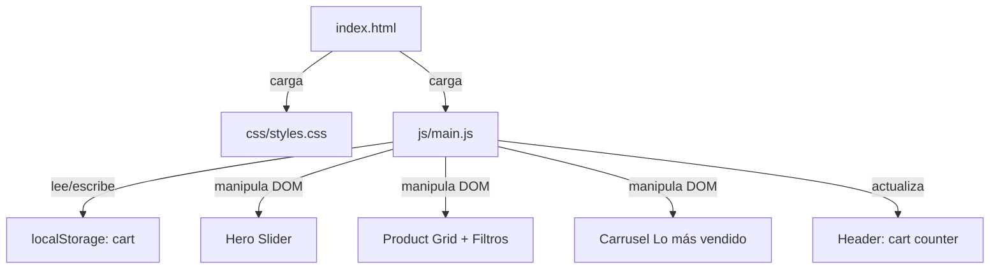

# Design Document: shoe-ecommerce-base

## Overview

E-commerce de calzado construido íntegramente con tecnologías web estándar (HTML5, CSS3, JavaScript vanilla). El sistema no depende de frameworks ni bundlers; cada página es un archivo HTML independiente que carga hojas de estilo desde `/css` y scripts desde `/js`. El estado del carrito se persiste en `localStorage` para sobrevivir recargas.

El foco de este documento es la implementación completa de `index.html` con:
- Hero section con slider automático de imágenes
- Sección de categorías destacadas
- Grid de productos con filtros rápidos por categoría
- Sección "Lo más vendido" con carrusel horizontal

---

## Architecture

```
shoe-ecommerce/
├── index.html
├── product.html
├── cart.html
├── css/
│   └── styles.css
├── js/
│   └── main.js
├── images/
│   └── (imágenes de productos y hero)
├── includes/
│   └── (fragmentos reutilizables opcionales)
└── admin/
    └── dashboard.html
```

### Flujo de datos (client-side only)



### Decisiones de diseño

- **Sin frameworks**: Vanilla JS para máxima portabilidad y cero dependencias de build.
- **CSS custom properties**: Variables para colores, tipografía y espaciado, facilitando theming.
- **Mobile-first**: Los media queries amplían el layout base (320px) hacia tablet (768px) y desktop (1024px).
- **Datos de ejemplo en JS**: Los productos se definen como array de objetos en `main.js`; en una iteración futura se reemplazaría por una API.

---

## Components and Interfaces

### 1. Hero Slider

Componente de presentación que rota automáticamente entre N slides (imagen de fondo + título + CTA).

```
HeroSlider
  - slides: Slide[]          // array de slides configurados en main.js
  - currentIndex: number
  - intervalId: number
  + init()                   // arranca el auto-play
  + goTo(index)              // navela a slide específico
  + next()                   // avanza al siguiente
  + prev()                   // retrocede al anterior
```

Interfaz DOM esperada:
```html
<section class="hero">
  <div class="hero__slides">
    <div class="hero__slide active" style="background-image: url(...)">
      <div class="hero__content">
        <h1>Título</h1>
        <a class="btn btn--primary" href="#">CTA</a>
      </div>
    </div>
    ...
  </div>
  <button class="hero__prev">‹</button>
  <button class="hero__next">›</button>
  <div class="hero__dots">...</div>
</section>
```

### 2. Category Section

Cuatro tarjetas estáticas (Deportivos, Casuales, Formales, Botas) con imagen e ícono. Sin lógica JS; solo CSS hover.

### 3. Product Grid + Quick Filters

```
ProductGrid
  - products: Product[]      // todos los productos
  - activeFilter: string     // categoría activa ('all' por defecto)
  + render(filter)           // renderiza tarjetas filtradas
  + attachFilterListeners()  // escucha clicks en botones de filtro
```

Cada `Product_Card` expone:
```html
<article class="product-card" data-category="deportivos">
  <div class="product-card__image-wrap">
    
  </div>
  <div class="product-card__body">
    <h3 class="product-card__name">...</h3>
    <div class="product-card__rating">★★★★☆ <span>(42)</span></div>
    <p class="product-card__price">$99.99</p>
    <a class="btn btn--outline" href="product.html?id=...">Ver detalles</a>
    <button class="btn btn--primary add-to-cart" data-id="...">Agregar al carrito</button>
  </div>
</article>
```

### 4. Bestsellers Carousel

```
Carousel
  - track: HTMLElement       // contenedor deslizable
  - items: HTMLElement[]
  - currentOffset: number
  + scrollNext()
  + scrollPrev()
  + autoScroll()             // opcional, pausa en hover
```

### 5. Cart Module

```
Cart
  + getItems(): CartItem[]
  + addItem(product, qty): void
  + updateCount(): void      // actualiza badge en header
  + persist(): void          // guarda en localStorage
  + load(): void             // carga desde localStorage
```

### 6. Header

Estático en HTML; el badge del carrito se actualiza por `Cart.updateCount()`. El menú hamburguesa se controla con una clase CSS `nav--open` toggled por JS.

---

## Data Models

### Product

```js
{
  id: string,           // "prod-001"
  name: string,         // "Air Runner Pro"
  category: string,     // "deportivos" | "casuales" | "formales" | "botas"
  price: number,        // 99.99
  rating: number,       // 4.5  (0–5)
  reviewCount: number,  // 42
  image: string,        // "images/prod-001.jpg"
  featured: boolean,    // aparece en grid destacados
  bestseller: boolean   // aparece en carrusel lo más vendido
}
```

### CartItem

```js
{
  productId: string,
  name: string,
  price: number,
  size: string,         // talla seleccionada (relevante en product.html)
  qty: number,
  image: string
}
```

### Slide

```js
{
  image: string,        // URL de imagen de fondo
  title: string,
  subtitle: string,
  ctaText: string,
  ctaHref: string
}
```

### FilterOption

```js
{
  value: string,        // "all" | "deportivos" | "casuales" | "formales" | "botas"
  label: string         // "Todos" | "Deportivos" | ...
}
```

---

## Correctness Properties

*A property is a characteristic or behavior that should hold true across all valid executions of a system — essentially, a formal statement about what the system should do. Properties serve as the bridge between human-readable specifications and machine-verifiable correctness guarantees.*

### Property 1: Referencias de assets en todos los HTML

*Para cualquier* archivo HTML del proyecto, todas las etiquetas `<link>` de estilos deben apuntar a `/css/` y todas las etiquetas `<script>` deben apuntar a `/js/`.

**Validates: Requirements 1.3**

---

### Property 2: Logo y navegación presentes en todas las páginas

*Para cualquier* página HTML del proyecto, el header debe contener un elemento de logo y enlaces de navegación a Inicio, Productos, Carrito y Contacto.

**Validates: Requirements 3.1, 3.2**

---

### Property 3: Badge del carrito refleja el conteo exacto

*Para cualquier* estado del carrito (incluyendo 0 ítems), la función `updateCount()` debe actualizar el badge del header para mostrar exactamente el número de ítems totales; cuando el conteo es 0, el badge no debe ser visible.

**Validates: Requirements 3.3, 3.4, 3.5**

---

### Property 4: Año de copyright es el año actual

*Para cualquier* momento en que se ejecute la función de copyright, el año mostrado en el footer debe ser igual a `new Date().getFullYear()`.

**Validates: Requirements 4.4**

---

### Property 5: Featured section renderiza mínimo 4 tarjetas

*Para cualquier* array de productos con al menos 4 elementos marcados como `featured: true`, la función de renderizado debe producir al menos 4 elementos `article.product-card` en el DOM.

**Validates: Requirements 5.2**

---

### Property 6: Agregar al carrito almacena el producto e incrementa el contador

*Para cualquier* producto válido, al invocar `Cart.addItem(product)` el producto debe aparecer en `Cart.getItems()` y el contador del header debe incrementarse en 1 respecto al valor anterior.

**Validates: Requirements 5.3, 5.4**

---

### Property 7: Selección de talla marca visualmente la talla elegida

*Para cualquier* conjunto de botones de talla y cualquier talla válida seleccionada, solo el botón correspondiente a esa talla debe tener la clase `size--selected`; los demás no deben tenerla.

**Validates: Requirements 6.2**

---

### Property 8: Agregar sin talla muestra error de validación

*Para cualquier* intento de agregar al carrito sin talla seleccionada, la función de validación debe retornar un error y el mensaje de validación debe ser visible en el DOM; el carrito no debe modificarse.

**Validates: Requirements 6.3**

---

### Property 9: Agregar con talla almacena la talla elegida

*Para cualquier* producto y cualquier talla válida seleccionada, al agregar al carrito el ítem almacenado en `Cart.getItems()` debe contener exactamente esa talla.

**Validates: Requirements 6.4**

---

### Property 10: Render del carrito incluye todos los campos requeridos

*Para cualquier* array de `CartItem` no vacío, la función de renderizado del carrito debe producir elementos que contengan nombre, talla, precio unitario y cantidad para cada ítem; si el array está vacío, debe mostrar el mensaje de carrito vacío.

**Validates: Requirements 7.1, 7.5**

---

### Property 11: Total del carrito es la suma exacta de precio × cantidad

*Para cualquier* conjunto de ítems en el carrito, el total mostrado debe ser igual a `Σ(item.price × item.qty)` con precisión de dos decimales.

**Validates: Requirements 7.2, 7.3**

---

### Property 12: Eliminar ítem lo remueve del carrito y actualiza el total

*Para cualquier* carrito con al menos un ítem y cualquier ítem de ese carrito, al eliminarlo el ítem no debe aparecer en `Cart.getItems()` y el total debe recalcularse correctamente.

**Validates: Requirements 7.4**

---

### Property 13: Round-trip de persistencia en localStorage

*Para cualquier* estado del carrito, serializar con `Cart.persist()` y luego cargar con `Cart.load()` debe producir un carrito con los mismos ítems (mismos `productId`, `qty`, `size`, `price`).

**Validates: Requirements 7.6**

---

### Property 14: Admin tabla renderiza todos los productos

*Para cualquier* array de productos, la función de renderizado de la tabla del admin debe producir exactamente tantas filas como productos haya en el array.

**Validates: Requirements 8.1**

---

### Property 15: Formulario admin con datos válidos agrega el producto

*Para cualquier* objeto de producto con todos los campos requeridos válidos, al procesar el submit del formulario el producto debe aparecer en la lista interna y en la tabla renderizada.

**Validates: Requirements 8.3**

---

### Property 16: Validación del formulario admin detecta campos vacíos

*Para cualquier* combinación de campos obligatorios vacíos en el formulario admin, la función de validación debe retornar errores para cada campo vacío y no debe agregar ningún producto a la lista.

**Validates: Requirements 8.4**

---

### Property 17: Transición de tarjeta de producto no supera 300ms

*Para cualquier* regla CSS aplicada a `.product-card` que incluya `transition`, la duración declarada debe ser menor o igual a 300ms.

**Validates: Requirements 9.3**

---

### Property 18: Unidades relativas en tipografía y espaciado CSS

*Para cualquier* declaración CSS de `font-size`, `margin`, `padding` o `gap` en `styles.css`, el valor no debe usar unidades `px` fijas (debe usar `rem`, `em`, `%`, `vw` o `vh`).

**Validates: Requirements 2.4**

---

## Error Handling

| Escenario | Comportamiento esperado |
|---|---|
| Agregar al carrito sin talla seleccionada | Mostrar mensaje inline "Por favor selecciona una talla" sin modificar el carrito |
| Formulario admin con campos vacíos | Mostrar mensaje de error debajo de cada campo inválido; no procesar el submit |
| `localStorage` no disponible (modo privado) | Capturar excepción en `Cart.persist()` / `Cart.load()` y operar en memoria sin crash |
| Imagen de producto no encontrada | Mostrar imagen placeholder via `onerror` en el `` |
| Carrito vacío al renderizar `cart.html` | Mostrar sección "Tu carrito está vacío" con enlace a `index.html` |
| Slider sin slides configurados | No inicializar el slider; no lanzar errores en consola |

---

## Testing Strategy

### Enfoque dual: Unit tests + Property-based tests

Ambos tipos son complementarios y necesarios:

- **Unit tests**: verifican ejemplos concretos, casos borde y condiciones de error.
- **Property tests**: verifican propiedades universales sobre rangos amplios de inputs generados aleatoriamente.

### Librería de property-based testing

Para JavaScript vanilla se usará **[fast-check](https://github.com/dubzzz/fast-check)** (npm install --save-dev fast-check). Cada test de propiedad debe ejecutarse con un mínimo de **100 iteraciones**.

### Etiquetado de tests

Cada test de propiedad debe incluir un comentario de referencia:

```
// Feature: shoe-ecommerce-base, Property N: <texto de la propiedad>
```

### Unit tests (ejemplos y casos borde)

- Verificar que `index.html` contiene sección hero con `h1` y enlace CTA.
- Verificar que `product.html` contiene campos de talla, imagen, precio y descripción.
- Verificar que `admin/dashboard.html` contiene el formulario con los campos requeridos.
- Verificar que `styles.css` define `--color-primary`, `--color-secondary`, `--color-accent`.
- Verificar que `styles.css` importa o referencia Google Fonts.
- Verificar que el footer de cada página contiene los tres enlaces secundarios y un email.

### Property tests (uno por propiedad de diseño)

| Test | Propiedad | Librería |
|---|---|---|
| Referencias CSS/JS en HTML | Property 1 | fast-check |
| Logo y nav en todas las páginas | Property 2 | fast-check |
| Badge del carrito refleja conteo | Property 3 | fast-check |
| Año de copyright | Property 4 | fast-check |
| Featured section ≥ 4 tarjetas | Property 5 | fast-check |
| Add to cart almacena e incrementa | Property 6 | fast-check |
| Selección de talla exclusiva | Property 7 | fast-check |
| Validación sin talla | Property 8 | fast-check |
| Talla almacenada correctamente | Property 9 | fast-check |
| Render carrito campos completos | Property 10 | fast-check |
| Total = Σ(precio × qty) | Property 11 | fast-check |
| Eliminar ítem actualiza carrito | Property 12 | fast-check |
| Round-trip localStorage | Property 13 | fast-check |
| Admin tabla = nº productos | Property 14 | fast-check |
| Admin form válido agrega producto | Property 15 | fast-check |
| Admin form inválido muestra errores | Property 16 | fast-check |
| Transición ≤ 300ms | Property 17 | fast-check |
| Unidades relativas en CSS | Property 18 | fast-check |

### Configuración de fast-check

```js
import fc from 'fast-check';

// Ejemplo: Property 11 - Total del carrito
// Feature: shoe-ecommerce-base, Property 11: Total del carrito es la suma exacta de precio × cantidad
fc.assert(
  fc.property(
    fc.array(
      fc.record({
        productId: fc.string(),
        price: fc.float({ min: 0.01, max: 9999.99 }),
        qty: fc.integer({ min: 1, max: 99 }),
      }),
      { minLength: 1 }
    ),
    (items) => {
      const expected = items.reduce((sum, i) => sum + i.price * i.qty, 0);
      const result = Cart.calculateTotal(items);
      return Math.abs(result - expected) < 0.01;
    }
  ),
  { numRuns: 100 }
);
```
