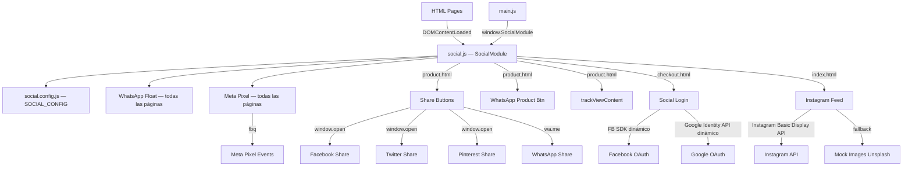

# Design Document — social-integrations

## Overview

El módulo `social-integrations` añade cinco capacidades sociales al e-commerce StepStyle sin introducir ningún framework: botones de compartir en producto, login social en checkout, feed de Instagram en homepage, botón flotante de WhatsApp en todas las páginas y seguimiento de eventos con Meta Pixel.

Todo el código de comportamiento reside en `js/social.js` (nuevo archivo). Las credenciales se centralizan en `js/social.config.js` (nuevo archivo). Los estilos se agregan al final de `css/styles.css`. Cada página HTML incluye `<script src="/js/social.js">` después de `main.js`.

El módulo opera en modo degradado cuando las credenciales están vacías: el feed muestra imágenes mock, el Pixel no se inyecta, y los SDKs de Facebook/Google no se cargan.

---

## Architecture



El módulo detecta la página activa mediante `window.location.pathname` y activa únicamente las integraciones pertinentes. Los SDKs externos (Facebook, Google) se cargan dinámicamente solo si el APP ID correspondiente está configurado.

---

## Components and Interfaces

### `js/social.config.js`

Expone el objeto global `SOCIAL_CONFIG`:

```js
window.SOCIAL_CONFIG = {
  META_PIXEL_ID:    "",   // ID numérico del Pixel de Meta
  FB_APP_ID:        "",   // App ID de Facebook para Login
  GOOGLE_CLIENT_ID: "",   // Client ID de Google Identity
  INSTAGRAM_TOKEN:  "",   // Token de Instagram Basic Display API
  WHATSAPP_NUMBER:  "",   // Número E.164 sin '+', ej: "521234567890"
};
```

### `js/social.js` — `window.SocialModule`

Funciones públicas expuestas en `window.SocialModule`:

| Función | Descripción |
|---|---|
| `trackViewContent(product)` | Dispara `fbq('track','ViewContent')` |
| `trackAddToCart(product)` | Dispara `fbq('track','AddToCart')` |
| `trackPurchase(order)` | Dispara `fbq('track','Purchase')` |

Funciones internas (no expuestas):

| Función | Página | Descripción |
|---|---|---|
| `initMetaPixel()` | todas | Inyecta script del Pixel en `<head>` |
| `initWhatsAppFloat()` | todas | Crea botón flotante fijo |
| `initShareButtons(product)` | product.html | Renderiza botones de compartir |
| `initWhatsAppProductBtn(product)` | product.html | Renderiza botón de consulta |
| `initSocialLogin()` | checkout.html | Renderiza sección de login social |
| `initInstagramFeed()` | index.html | Renderiza feed o mock |
| `buildShareURL(network, product)` | — | Construye URL de compartir |
| `buildWhatsAppURL(number, text)` | — | Construye URL `wa.me` |
| `openPopup(url)` | — | `window.open(url, '_blank', 'width=600,height=400')` |

### Integración con `main.js`

`main.js` invoca las funciones de Pixel a través de `window.SocialModule`:

```js
// En doAddToCart() de main.js (product page):
window.SocialModule?.trackAddToCart(product);

// En initCartPage() al confirmar pedido:
window.SocialModule?.trackPurchase(order);
```

---

## Data Models

### `SOCIAL_CONFIG`

```ts
interface SocialConfig {
  META_PIXEL_ID:    string;
  FB_APP_ID:        string;
  GOOGLE_CLIENT_ID: string;
  INSTAGRAM_TOKEN:  string;
  WHATSAPP_NUMBER:  string;
}
```

### `InstagramPost` (interno)

```ts
interface InstagramPost {
  id:        string;
  media_url: string;
  permalink: string;
}
```

### `ShareProduct` (parámetro interno)

```ts
interface ShareProduct {
  name:     string;   // nombre del producto
  url:      string;   // URL canónica (window.location.href)
  imageUrl: string;   // URL de imagen principal
  id:       string;   // product ID para Pixel
  price:    number;   // precio para Pixel
}
```

### `PixelOrder` (parámetro de trackPurchase)

```ts
interface PixelOrder {
  total:      number;
  currency:   string;   // "MXN"
  productIds: string[]; // array de IDs
}
```

### Mock Instagram Data

Cuando `INSTAGRAM_TOKEN` está vacío, se usan 6 imágenes de Unsplash de zapatos:

```js
const INSTAGRAM_MOCK = [
  { id:'m1', media_url:'https://images.unsplash.com/photo-1542291026-7eec264c27ff?w=400&q=80', permalink:'https://instagram.com/stepstyle' },
  { id:'m2', media_url:'https://images.unsplash.com/photo-1600185365483-26d7a4cc7519?w=400&q=80', permalink:'https://instagram.com/stepstyle' },
  { id:'m3', media_url:'https://images.unsplash.com/photo-1543163521-1bf539c55dd2?w=400&q=80', permalink:'https://instagram.com/stepstyle' },
  { id:'m4', media_url:'https://images.unsplash.com/photo-1608256246200-53e635b5b65f?w=400&q=80', permalink:'https://instagram.com/stepstyle' },
  { id:'m5', media_url:'https://images.unsplash.com/photo-1606107557195-0e29a4b5b4aa?w=400&q=80', permalink:'https://instagram.com/stepstyle' },
  { id:'m6', media_url:'https://images.unsplash.com/photo-1614252235316-8c857d38b5f4?w=400&q=80', permalink:'https://instagram.com/stepstyle' },
];
```

---

## Correctness Properties


*A property is a characteristic or behavior that should hold true across all valid executions of a system — essentially, a formal statement about what the system should do. Properties serve as the bridge between human-readable specifications and machine-verifiable correctness guarantees.*

### Property 1: Share URL contiene parámetros requeridos por red social

*For any* red social (Facebook, Twitter, Pinterest, WhatsApp) y cualquier producto con nombre, URL e imagen, `buildShareURL(network, product)` debe producir una URL que contenga la URL canónica del producto codificada, y para Twitter también el nombre del producto, y para Pinterest también la URL de imagen.

**Validates: Requirements 1.3, 1.4, 1.5, 1.6**

### Property 2: Share buttons tienen aria-label no vacío

*For any* renderizado de share buttons, cada botón generado debe tener un atributo `aria-label` con valor no vacío.

**Validates: Requirements 1.8**

### Property 3: Pre-relleno de formulario con datos de login social

*For any* objeto de usuario `{ name, email }` retornado por un proveedor social, la función de pre-relleno debe asignar `name` al campo `#field-name` y `email` al campo `#field-email`.

**Validates: Requirements 2.5**

### Property 4: Instagram feed siempre renderiza exactamente 6 items

*For any* estado de configuración (con token válido, con token vacío, o con fallo de API), `initInstagramFeed()` debe renderizar exactamente 6 elementos en la cuadrícula del feed.

**Validates: Requirements 3.2, 3.6**

### Property 5: Links del feed tienen target y rel correctos

*For any* post del Instagram feed (real o mock), el enlace generado debe tener `target="_blank"` y `rel="noopener noreferrer"`.

**Validates: Requirements 3.4**

### Property 6: WhatsApp URL sigue formato wa.me

*For any* número de WhatsApp y texto de mensaje, `buildWhatsAppURL(number, text)` debe producir una URL con el formato `https://wa.me/{number}?text={encodedText}` donde el texto está correctamente codificado con `encodeURIComponent`.

**Validates: Requirements 4.3, 5.2, 5.3**

### Property 7: Mensaje WhatsApp producto incluye nombre y URL; talla solo si está seleccionada

*For any* producto con nombre y URL, cuando se construye el mensaje de consulta:
- Si hay talla seleccionada: el mensaje debe contener el nombre del producto, la talla y la URL.
- Si no hay talla seleccionada: el mensaje debe contener el nombre del producto y la URL, pero no referencia a talla.

**Validates: Requirements 5.2, 5.3**

### Property 8: Meta Pixel inyecta script con ID correcto cuando está configurado

*For any* `META_PIXEL_ID` no vacío, después de llamar `initMetaPixel()` debe existir un elemento `<script>` en `document.head` cuyo contenido incluya ese ID.

**Validates: Requirements 6.1, 6.2**

### Property 9: Eventos Pixel incluyen parámetros requeridos

*For any* producto válido, `trackViewContent(product)` debe invocar `fbq('track', 'ViewContent', params)` donde `params` contiene `content_name`, `content_ids` y `value`. Análogamente, `trackAddToCart` incluye además `currency`, y `trackPurchase` incluye `value`, `currency` y `content_ids`.

**Validates: Requirements 7.1, 7.2, 7.3**

### Property 10: Funciones de tracking son seguras cuando fbq no está definido

*For any* estado donde `window.fbq` no existe, llamar a `trackViewContent`, `trackAddToCart` o `trackPurchase` no debe lanzar ninguna excepción.

**Validates: Requirements 7.4**

### Property 11: Módulo activa solo integraciones de la página actual

*For any* pathname que no sea `product.html`, inicializar el módulo no debe insertar share buttons ni el botón de consulta WhatsApp en el DOM. Análogamente para `checkout.html` (no social login en otras páginas) e `index.html` (no feed en otras páginas).

**Validates: Requirements 9.3**

### Property 12: Módulo no lanza errores en páginas sin integraciones aplicables

*For any* página del sitio, llamar a la función de inicialización del módulo no debe lanzar ninguna excepción, independientemente de si las integraciones de esa página están activas o no.

**Validates: Requirements 9.5**

---

## Error Handling

| Escenario | Comportamiento |
|---|---|
| `META_PIXEL_ID` vacío | `initMetaPixel()` retorna sin inyectar nada, sin log de error |
| `FB_APP_ID` vacío | No se carga el Facebook SDK; botón de login Facebook no se renderiza |
| `GOOGLE_CLIENT_ID` vacío | No se carga Google Identity API; botón Google no se renderiza |
| `INSTAGRAM_TOKEN` vacío | Se usan los 6 mocks de Unsplash |
| `WHATSAPP_NUMBER` vacío | El botón flotante y el botón de producto se renderizan pero el href apunta a `https://wa.me/` (sin número) |
| Fallo de fetch Instagram API | `catch` silencioso → fallback a mocks |
| `fbq` no definido | Guard `if (typeof fbq === 'function')` antes de cada llamada |
| Facebook OAuth falla | Muestra `<div class="social-login__error">` con mensaje no bloqueante |
| Google OAuth falla | Igual que Facebook |
| `window.SocialModule` no disponible en main.js | Uso de optional chaining `window.SocialModule?.trackAddToCart(...)` |

---

## Testing Strategy

### Enfoque dual

Se usan dos tipos de tests complementarios:

- **Unit tests**: verifican ejemplos concretos, casos de integración y condiciones de error.
- **Property-based tests**: verifican propiedades universales sobre rangos de inputs generados aleatoriamente.

### Librería de property-based testing

Para Vanilla JS se usa **[fast-check](https://github.com/dubzzz/fast-check)** (npm install --save-dev fast-check). Cada test de propiedad se ejecuta con mínimo 100 iteraciones (configuración por defecto de fast-check).

### Unit tests (ejemplos y edge cases)

Archivo: `js/__tests__/social.unit.test.js`

- Share buttons se renderizan con los 4 botones en el DOM (Req 1.1, 1.2)
- Social login se renderiza con separador y 2 botones (Req 2.1, 2.2, 2.7)
- Mensaje de error aparece al fallar autenticación (Req 2.6)
- Feed muestra título "Síguenos en Instagram" con @stepstyle (Req 3.5)
- WhatsApp Float tiene `aria-label="Contactar por WhatsApp"` (Req 4.5)
- WhatsApp Product Btn tiene ícono SVG (Req 5.5)
- `initMetaPixel()` con ID vacío no inyecta script (Req 6.3)
- Código de pixel incluye noscript fallback (Req 6.4)
- `trackViewContent` con `fbq` no definido no lanza error (Req 7.4)
- `SOCIAL_CONFIG` tiene las 5 claves con valores vacíos por defecto (Req 8.1, 8.2)
- `window.SocialModule` expone las 3 funciones de tracking (Req 9.4)

### Property-based tests

Archivo: `js/__tests__/social.property.test.js`

Cada test referencia su propiedad del diseño con el tag:
`// Feature: social-integrations, Property N: <texto>`

```
// Feature: social-integrations, Property 1: Share URL contiene parámetros requeridos
fc.assert(fc.property(
  fc.constantFrom('facebook','twitter','pinterest','whatsapp'),
  fc.record({ name: fc.string({minLength:1}), url: fc.webUrl(), imageUrl: fc.webUrl(), id: fc.string(), price: fc.float({min:0}) }),
  (network, product) => {
    const url = buildShareURL(network, product);
    assert(url.includes(encodeURIComponent(product.url)));
    if (network === 'twitter') assert(url.includes(encodeURIComponent(product.name)));
    if (network === 'pinterest') assert(url.includes(encodeURIComponent(product.imageUrl)));
  }
), { numRuns: 100 });

// Feature: social-integrations, Property 2: Share buttons tienen aria-label no vacío
// Feature: social-integrations, Property 3: Pre-relleno de formulario con datos de login social
// Feature: social-integrations, Property 4: Instagram feed siempre renderiza exactamente 6 items
// Feature: social-integrations, Property 5: Links del feed tienen target y rel correctos
// Feature: social-integrations, Property 6: WhatsApp URL sigue formato wa.me
// Feature: social-integrations, Property 7: Mensaje WhatsApp producto incluye nombre y URL
// Feature: social-integrations, Property 8: Meta Pixel inyecta script con ID correcto
// Feature: social-integrations, Property 9: Eventos Pixel incluyen parámetros requeridos
// Feature: social-integrations, Property 10: Funciones de tracking seguras sin fbq
// Feature: social-integrations, Property 11: Módulo activa solo integraciones de la página actual
// Feature: social-integrations, Property 12: Módulo no lanza errores en páginas sin integraciones
```

Cada propiedad del diseño debe ser implementada por exactamente un test de propiedad. Mínimo 100 iteraciones por test (`numRuns: 100`).
